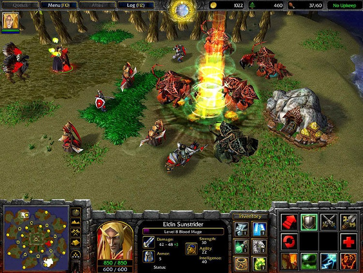
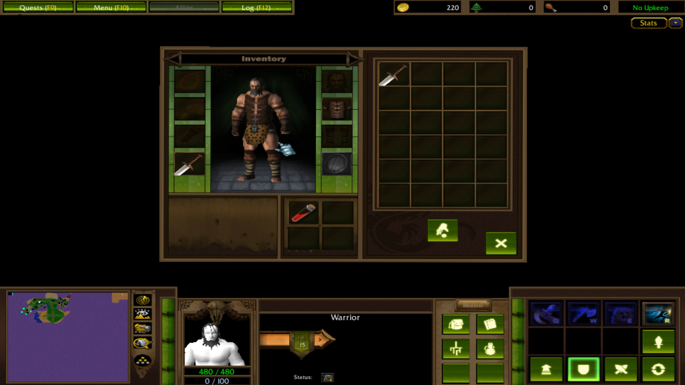

# Sonar Avoidance

Sonar avoidance is state of the art agents local avoidance algorithm that I created for my RTS game. It is heavily inspired by Starcraft 2 and by GDC 2011 talk [AI Navigation: It's Not a Solved Problem - Yet](https://www.gdcvault.com/play/1014514/AI-Navigation-It-s-Not). As the talk did not really went into any algorithmic details and only presenting surface level concept, I consider this algorithm fully my own. However I would not be suprised that somebody else also created something similar at some point under different name. In this blog I will cover the history how I come up this algorithm and will explain in details how it functions.

For those who interested the sonar avoidance is implementation. It is available in Unity Engine and can be bought in asset store as standalone algorithm [Local Avoidance]() and full integration with unity navmesh in [Agents Navigation]().
Since 2022 these packages where downloaded ~23k times and succesfully released in many games. I personally consider this algorithm quite successful.

## History

### Map Editor

In 2014 I started working in Unity this is where I discovered the Unity Engine as tool for creating the games. I quickly fell in love with the tool and decided that I want to create the game with it. This then I started developing my wacraft 3 mobile knock-off.

In high-sight it was not the greatest choice to straight up copy game even, if it was idea to put it into mobile. As it would not get past neither the android store or apple store, but I had this delusional hope that maybe Blizzard would get interested in project. Well that of course never happened, but believe me I tried...

There was actually the reason why I chose this delusional project. Back in my teens I was insanly invested in Warcraft 3 modding. The warcraft 3 had this tool called warcraft 3 map editor it allowed creation of what they called `Map`, which can later on be hosted in multiplayer and played by other users. Map editor was very powerful and I think to this day is probably the greatest blizzard creation, but that is a topic for another time. With map editor you could create completetly different game genres. The editor supported UI modifications, model importing, effects importing, Trigger Editor for gui based scripting and JASS (Just another scripting syntax) for text based scripting. There was multiple communities and sities with people creations. I think the one of the most popular was [HiveWorkshop](https://www.hiveworkshop.com/) where I was also spending lots of my time. Hive workshop was full of free content created from pashioned warcraft fans, everything from icons to models and maps.

For those who never played Warcraft 3, this is how standard maps looked like in warcraft 3 a.k.a. `Melee` maps.

There is few projects that I worked on.

### Warcraft in Unity

As my RTS was in Unity Engine for obvious reasons I started my project using default unity navigation solution that uses for global navigation navmesh and for local avoidance RVO2 a.k.a ORCA (Optimal Reciprocal Collision Avoidance). This algorithm is extended version of RVO that designed to more accurate avoidance then there are multiple agents. In many games this algorithm is perfect, it produces really nice avoidance in bigger groups, somewhat very similar to crowds. However in indivual agent motion algorithm starts to show some cracks, the agents very often in bigger crowd loses lots of velocity, they start clump into the points instead of surrounding the destination what would you expect typically in RTS, it also gets very easily stuck, if tries to get
