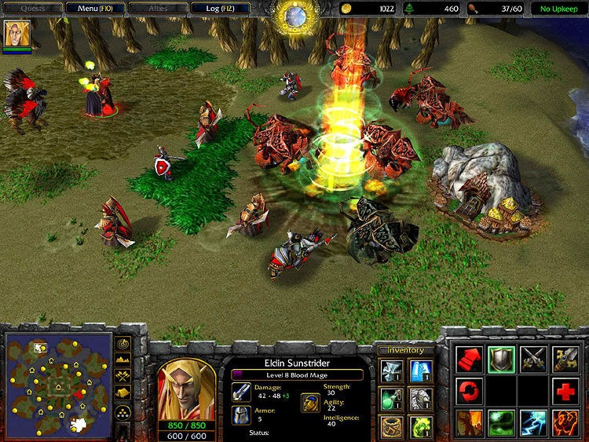
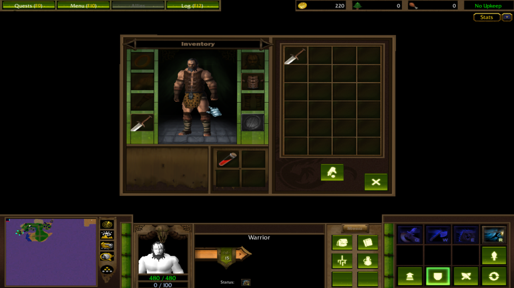

# Sonar Avoidance

Sonar avoidance is state of the art agents local avoidance algorithm that I created for my RTS game. It is heavily inspired by Starcraft 2 and by GDC 2011 talk [AI Navigation: It's Not a Solved Problem - Yet](https://www.gdcvault.com/play/1014514/AI-Navigation-It-s-Not). As the talk did not really went into any algorithmic details and only presenting surface level concept, I consider this algorithm fully my own. However I would not be suprised that somebody else also created something similar at some point under different name. In this blog I will cover the history how I come up this algorithm and will explain in details how it functions.

For those who interested the sonar avoidance is implementation. It is available in Unity Engine and can be bought in asset store as standalone algorithm [Local Avoidance](https://assetstore.unity.com/packages/tools/behavior-ai/local-avoidance-214347) and full integration with unity navmesh in [Agents Navigation](https://assetstore.unity.com/packages/tools/behavior-ai/agents-navigation-239233).
Since 2022 these packages where downloaded ~23k times and succesfully released in many games. Maybe numbers dont sounds that staggering big, but dont forget these are not end users that downloaded, but developers that use to create their games. For this reason I consider it big success and main reason of writing this blog article sharing a bit insights about sonar avoidance algorithm.

## History Of Algorithm

In this section I am going to cover a bit the motivation and how I come with the algorithm. If you more interested in technical details, I recommend skipping this section as you probably wont find it interested.

### Warcraft

In 2014 I started working in Unity this is where I discovered the Unity Engine as tool for creating the games. I quickly fell in love with the tool and decided that I want to create the game with it. This then I started developing my wacraft 3 mobile knock-off.

  

    <iframe
      src="https://www.youtube.com/embed/knjl9LzwPfU"
      title="Warcraft On Mobile"
      style="position:absolute;top:0;left:0;width:100%;height:100%;"
      frameborder="0"
      allowfullscreen>
    </iframe>
  

In high-sight it was not the greatest choice to straight up copy game even, if it was idea to put it into mobile. As it would not get past neither the android store or apple store, but I had this naive hope that maybe Blizzard would get interested in project. Well that of course never happened, but believe me I tried...

There was actually the reason why I chose this project. Back in my teens I was insanly invested in Warcraft 3 modding. The warcraft 3 had this tool called warcraft 3 map editor it allowed creation of what they called `Map`, which can later on be hosted in multiplayer and played by other users. Map editor was very powerful and I think to this day is probably the greatest blizzard creation, but that is a topic for another time. With map editor you could create completetly different game genres. The editor supported UI modifications, model importing, effects importing, Trigger Editor for gui based scripting and JASS (Just another scripting syntax) for text based scripting. There was multiple communities and sities with people creations. I think the one of the most popular was [HiveWorkshop](https://www.hiveworkshop.com/) where I was also spending lots of my time. Hive workshop was full of free content created from pashioned warcraft fans, everything from icons to models and maps.

For those who never played Warcraft 3, this is how standard maps looked like in warcraft 3 a.k.a. `Melee` maps.

There is few projects that I worked on personally.

### Navigation Solution
Probably one of the most important feature in RTS game is having good agent navigation solution. If it does not work that well people will get very frustrated and probably will stop playing your game. So its very important to make that part right. Probably to this day starcaft 2 navigation is considered one of the best navigation solution in rts game. It was done so well that many starcraft pros hated it as it made agent navigate to easily reducing the agent macroing element as the skill which was quite relevent in starcraft 1.

### Unity Navigation
As I was creating my game with unity engine I firstly tried their builtin solution. It was combination of two solution for global navigation using navigation mesh and for local avoidance [ORCA](https://gamma.cs.unc.edu/ORCA/).

[Navigation Mesh or navmesh](https://en.wikipedia.org/wiki/Navigation_mesh) is simply put triangulated mesh of your game world, where none of the mesh edges intersect your game obstacles. Building navmesh is quite expensive, but it has way fewer nodes compared to grid based solutions. For path finding path it simply runs [A* Search Algorithm](https://en.wikipedia.org/wiki/A*_search_algorithm) using the start and end node.

However as navmesh is quite expensive to rebuild it is only used for static obstacles like buildings, but agents that constantly stopping and moving is not used. This is where it comes the local avoidance solution called [ORCA](https://gamma.cs.unc.edu/ORCA/). This algorithm is extended version of RVO that designed to more accurate avoidance then there are multiple agents. In many games this algorithm is perfect, it produces really nice avoidance in bigger groups, somewhat very similar to crowds. However in indivual agent motion algorithm starts to show some cracks.

One of the main undesired behaviour I noticed quite immediately was in typical RTS scenarios where you have groups of agents trying to surround the target. With orca agents would start to just clump on one side of the agent instead of trying to surround it. Where in games likes warcraft 3 where each agent is very essential that would not be acceptable as many agants would simply stand instead of attacking.
TODO video

The next issue with ORCA I noticed that algorithm quite heavily relied on varrying velocities of agents. Which makese a lot of sense in crowd simulations and there is lots of nice papers going in details how density based velocities performs increadibly well in high congestion scenarios. However in game cases where high congestion scenarios less frequent and you have huge groups just moving to some objective it very quikcly becomes a drawback. As your agants no longer maximize they speed. As for example, if you moving just one agent around another agents either them moving or not, you dont want it to slow down in sake of other agents as you prioritize it.
TODO video

The last thing I found very inconvient with orca that it really struggled to escape cases where agents would form concave walls. So agent moving into these scenarios would straight up end up stuck.
TODO video

After seeing this issue I realised that navmesh+orca was not going to cut for me as navigation solution for my game. I started reaserching the alternatives. At least back then around 2016 it was really hard to find any information about the other succesful rts game navigation solutions, information was very sparse and kept at minimum. My guess was that a lot of success around rts games was how well their agents able to navigate and componies treated them as secret to avoid competition. But that is just my guess, yours good as mine.

#### Warcraft 3 Navigation
Obvious first research point was the warcraft navigation as I was recreating the warcraft that was kinda non brainer. What I found from my investigation that warcraft was using grid based solution for both global navigation and local avoidance.

For those who dont know the grid based navigation. It is essentially splitting your game world into 2d node graph where each node is fixed size quad. Where node indicates, if it is traversable or not. Usually if there is some obstacle it will indicate that node as non traversable. Then each agent knowing its start and destination node simply run [A* Search Algorithm](https://en.wikipedia.org/wiki/A*_search_algorithm) to quikcly find shortest node subset that will need to traverse in order to reach destination without stepping on blocked nodes.

In warcraft 3 you rarely have more than 20-30 agents this is usually capped by food resource in the game. However for those who used map editor and tried maps with this limitation removed, you quickly notice how poorly this navigation solution performance in groups of 100 and more. Agents start to stop, block each other, jitter and it lots of comes that local avoidance being combined with global navigation in discrete space. It simply lacks fluid motion that you can see in starcraft 2. Even though I was recreating warcraft 3 in agents I wanted to make it better, so for this reason I decided not to go with same solution as my predecessor.

#### Supreme Commander 2 Navigation
In my eyes starcraft 2 was on the top of being pathfinding department. However there was one more game that equally amazed me even more was Supreme Commander 2.
The navigation of crowds in that game was on another level. Where two huge groups would traverse each other almost like fluid.
TODO supreme command 2

After investigation I found they where using modified solution of [Continuum Crowds](https://grail.cs.washington.edu/projects/crowd-flows/continuum-crowds.pdf). It is another grid based graph node solution, but uses [flow fields](https://en.wikipedia.org/wiki/Flow_(mathematics)). Traditionally you would have agent individually calculating its path from start to end node, where with flow field each node acts as start node and its velocity guides to shared end node(s). You can imagine flow field as ocean and the end goal as vortex, regardless where you put ure agent in ocean it will get guided towards the vortex. So continuum crowds is esentially flow field solution, but it takes into account information like density of agents in place, how fast agents are moving in place, thus archieving very fluid motion.

The glaring issue with flow fields in general as path calculation happens on shared goal accross whole graph. Which makes it extremely afficient in huge groups that share same goal, but very inefficient in cases where there is a lot of agents with invididual goals or even with maps that are very huge. Of course there are modifications that one way or another way leviate the cost in these scenarios, but does solve them completely. So the game has to be designed around this limitations as that can be seen in supreme commander 2 that mostly groups are controlled and there are not worker agents. Where in warcraft 3 you have a lot of agents moving individually like workers, hero, neutral monsters and so on.

#### Starcraft 2 Navigation
Eventually I come back to game that in my opinion had one of the most amazing agent navigation solutions. Finding information about starcraft 2 navigation was quite a challanage as seems like blizzard was keeping it quite hidden. After experimenting with their editor and in game, I found quite quikcly that their where using the navmesh for global navigation and for local avoidnace they had their own propertery solution. The only source of information I managed to stumble was GDC 2011 talk [AI Navigation: It's Not a Solved Problem - Yet](https://www.gdcvault.com/play/1014514/AI-Navigation-It-s-Not). In that gdc talk blizzard very briefly covered their navigation solution more from terms of challange they had to face it, but did not really dwell into technical details. They also confirmed using navmesh as I guessed and quite nicely explained how they did rebuilding. As for navmesh it seems like they used way simplier solution compared what unity had as unity allowed baking navmesh pretty much in 3d space, where starcraft 2 solution was mainly tied to 2.5d world. For the avoidance main hint that they gave away that they had almost like vision based solution where agent would try to look some distance in front of him and look for openings to avoid collision and slip in.

## Algorithm 1.0
Idea of sonar avoidance is actually quite simple at its core. Imagine each agent has field of view, similarly like humans that has roughly ~200-220° horizontally and ~130-135° vertically.
TODO photo

Now as agents dont need to be that complex as human beings for most of the games, we can actually ignore vertical field of view and stick only to horizontal. This simplifies problem from 2d space into 1d space and we can convert our vision into simple arcing line. From algorithm side we treat this arching line as simple range. Where start is the left angle of field of view horizontally being -110° and end value being the right 110°. As you can see we have this space slightly shifted so that center is 0°, that will be important.
TODO photo

As we split this line into two ranges where first one is range (-110°:0°) and second one is range (0°:110°). Essentially having our field of view split into positive and negative sides. From mathematically point we have array of ranges:
`V = [-110:0; 0:110]`
TODO photo

Now each obstacle is essentially acts similarly like it would block human vision, the bigger it is and closer it is the more vision it blocks. If it is outside the vision radius we ignore it. Each obstacle has position P and radius R, so the function essentially converts from agents world space into this sonar space resulitng in new range `f(Pi, Pr) -> R2`. Finally we use this obstacle line to check each `V` lines and if they overlap cut, that usually produces either removal of line, reducing in length or resulting two new lines.
TODO photo

After all obstacle included we should end up with new array of lines:
`R = [x0; x1; ..., xn] where xi is R2`
TODO photo

Now resulting new array `R` each element is potential range of angles that this agent could take without colliding with obstacles. However usually each agent has some desired direction that comes either from destination or global planning. In this case we treat that agent desired direction would be at angle 0°, so with that in mind, if we find the line that is closest to it. It will be the best angle. Also as we have desired direction at 0° we dont need to look for best angle at the line itself as it always will be either start or end depending was the line on positive or negative side then we split at first. In case `R` is empty it means it is fully blocked and it can do some custom decision.

### TODO
This should already produce nice local avoidance around static obstacle and should even able to escape some of the cases where agent is surrounded by obstacles more in concave fashion. However as agent dont store any state from its previous movement it can quite easily start bouncing back and forth. To solve this it also good in array `R` instead of selecting just closest line to center, also check for line that is close to agents currenty velocity. This could be as simple just calculating cost function `C(xi) = a * d(x1) + b *v(x1)`, where `d(x)` calculates distance to center and `v(x)` calculates distance to velocity and `a` and `b` being simple weights where `a + b = 1.0`.

## Algorithm 2.0
